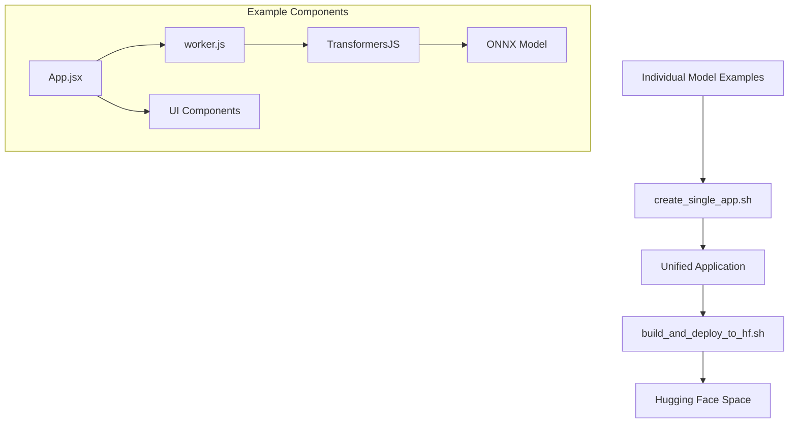

# TransformersJS Examples

This repository contains a collection of example applications demonstrating the capabilities of [TransformersJS](https://github.com/xenova/transformers.js), allowing you to run machine learning models directly in the browser. This project provides both standalone examples and a unified application that combines multiple models into a single cohesive experience.

> **Important**: This project builds upon the original examples from [huggingface/transformers.js-examples](https://github.com/huggingface/transformers.js-examples). Please star and watch the original repository for updates and new examples.

## 🌟 Features

- **Multiple Model Examples**: Collection of individual TransformersJS model examples
- **Unified Application**: A single application that integrates all examples with consistent navigation
- **WebGPU Support**: Hardware acceleration for compatible browsers and models
- **Easy Deployment**: Scripts for building and deploying to Hugging Face Spaces

## 🧩 Included Models & Examples

The repository includes examples for various machine learning tasks:

| Model | Description | WebGPU |
|-------|-------------|--------|
| Llama 3.2 | Text generation using Llama 3.2 | ⚡ Required |
| Phi 3.5 | Text generation using Phi 3.5 | ⚡ Required |
| Janus | Multimodal text generation with image capabilities | ⚡ Required |
| Florence 2 | Vision model for image understanding and captioning | ⚡ Required |
| Cross Encoder | Text similarity and relevance scoring | No |
| Zero-Shot Classification | Classify text without specific training | No |
| SpeechT5 | Convert text to speech | No |
| Text-to-Speech | Generate speech from text with acceleration | ⚡ Required |

## 🚀 Getting Started

### Running Individual Examples

Each example can be run independently. For instance, to run the zero-shot classification example:

```bash
cd zero-shot-classification
npm install
npm run dev
```

### Creating the Unified Application

To combine all examples into a single application, use the provided script:

```bash
./create_single_app.sh [output_dir]
```

This will:
1. Create a new project with the specified name (default: `transformers-unified`)
2. Set up a React application with routing
3. Integrate all individual examples as sub-routes
4. Configure the necessary dependencies and building tools

The unified application will automatically detect WebGPU support and display appropriate warnings for models requiring hardware acceleration.

### Deploying to Hugging Face Spaces

Once you've created the unified application, you can deploy it to Hugging Face Spaces:

```bash
./build_and_deploy_to_hf.sh
```

This script:
1. Builds the unified application using Vite
2. Clones your Hugging Face Space repository
3. Copies the built files to the Space
4. Commits and pushes the changes

## 📋 Project Structure

```
├── [individual model examples]  # Standalone examples (e.g., zero-shot-classification)
├── create_single_app.sh         # Script to create unified application
├── build_and_deploy_to_hf.sh    # Script to deploy to Hugging Face Spaces
├── extract_package_json.py      # Utility for package.json analysis
└── transformers-unified/        # Created by the script (not in repo)
```

Each individual model example follows a similar structure:

```
├── src/                # Source code
│   ├── components/     # React components
│   ├── worker.js       # Web worker for model inference
│   ├── App.jsx         # Main application component
│   └── main.jsx        # Entry point
├── public/             # Static assets
└── package.json        # Dependencies
```

## 🔧 Technical Details

- **Framework**: React with Vite
- **Styling**: Tailwind CSS
- **Routing**: React Router
- **Model Loading**: Web Workers for non-blocking UI
- **Acceleration**: WebGPU for supported models and browsers

## 🔧 Technical Details

- **Framework**: React with Vite
- **Styling**: Tailwind CSS
- **Routing**: React Router with SPA routing
- **Model Loading**: Web Workers for non-blocking UI
- **Acceleration**: WebGPU for supported models and browsers

### Mobile Compatibility

While the examples work well on desktop browsers with WebGPU support, mobile compatibility is still being investigated. Contributions and observations in this area are particularly welcome.

## 🔍 What's Next?

This repository serves as a starting point for exploring TransformersJS capabilities. Some areas for further exploration:

- Optimizing for mobile devices
- Investigate alternative loading strategies for hybride online / offline use cases
- Leveraging tools from the [HF ONNX Community](https://huggingface.co/onnx-community) to convert add models

## 🙏 Credits

- Original examples from [huggingface/transformers.js-examples](https://github.com/huggingface/transformers.js-examples) - worth starring and watching!
- Models converted to ONNX from [Hugging Face](https://huggingface.co)
- TransformersJS library by [Hugging Face](https://github.com/huggingface/transformers.js/)
- Individual code examples from the TransformersJS community

## 🤝 Contributing

If you are interested in contributing I recommend you check out the [transformers.js examples repository](https://github.com/huggingface/transformers.js-examples)

## 📄 License

This project is licensed under the terms specified by Hugging Face:
- https://github.com/huggingface/transformers.js/blob/main/LICENSE
- https://github.com/huggingface/transformers.js-examples/blob/main/LICENSE

## 📊 Project Architecture

